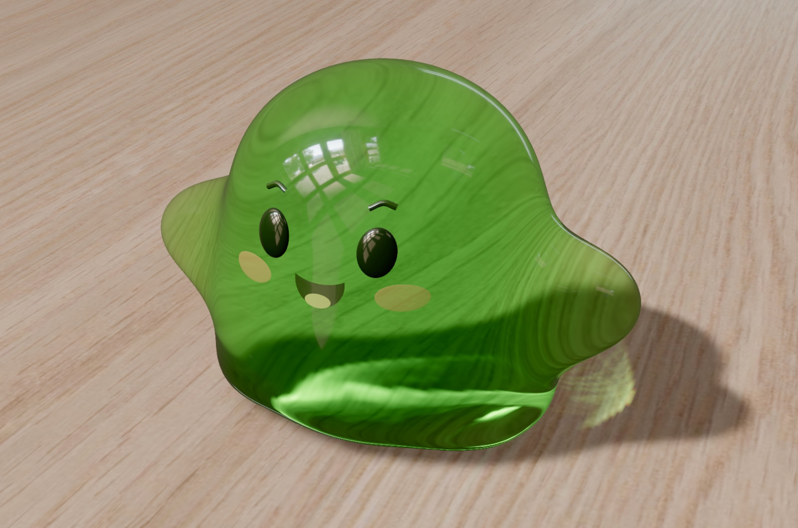

# Jelly Baby

A WebGPU-only, Three.js r185 playground. The supplied EXR lights the scene; the
wood maps repeat every 2.5 metres. The baby is modelled at approximately 7 cm.



```sh
npm run dev
```

WASD / arrow keys move relative to the camera. Space hops. Drag the table to
orbit, scroll or pinch to zoom, and drag the baby to stretch and throw. The camera
holds still during a grab and follows smoothly after release. Touch controls
appear on mobile. R resets. Sound starts with the first interaction.

## Implementation

- `src/physics/soft-body.js` uses the reference's neo-Hookean energy with coupled
  XPBD constraints, an orientation barrier, axial viscosity, Coulomb contact and
  force-limited barycentric grabbing. Coupling the elastic constraints eliminates
  artificial rest stress; whole-step backtracking prevents inverted elements.
  The 240 Hz fixed step matches `refs/jelly-webgpu.html`. Gravity is deliberately
  reduced to 2.4 m/s², with a smaller jump impulse for a gentle, floating hop.
- The displayed body is the exact marching-tetrahedra mesh from
  `refs/jelly_baby_mesh.html`, uniformly scaled to 7 cm: 72,234 indexed vertices,
  144,464 triangles and no open edges. `npm run build:model` regenerates its binary
  asset and source hash. A regular tetrahedral cage deforms those vertices through
  barycentric embedding; contacts lie on the actual visible surface. The original
  smooth SDF normals follow the deformation. The face follows the skin. Details are
  tessellated, kept outside the skin, and drawn after transmission so they cannot
  contaminate the opaque refraction buffer and produce duplicate images.
- `src/game/locomotion.ts` supplies a powered posture and gait through nodal
  forces and jump impulses. It does not replace particle positions with animation.
  The muscles release completely during a grab and recover gradually afterward.
  Gait forces stop when movement stops; damping dissipates recoil and the settled
  body sleeps until the next interaction.
- The reference's RGB surface tracing, Fresnel transmission, internal reflection,
  absorption, and per-vertex optical thickness run in a worker. There is one
  outstanding snapshot at a time. Translation compensation keeps the light field
  attached while the worker traces the changing shape. A 256² RGBA16F receiver
  preserves bright caustic flux; vertical motion reprojects the directional shadow.
  Connected refracted beams replace point splats. Their incident flux is divided
  by the landed footprint and integrated over each receiver pixel, including
  subpixel footprints and overlapping folds, without a caustic blur kernel.
- The supplied HDR window is reoriented above the set, boosted, and balanced
  against reduced room fill. Window direction, color, and flux are then measured
  from that same edited HDR, combining adjacent panes into one emitter.
  The floor removes that source's occluded diffuse contribution and reconstructs
  transmitted flux. Environment illumination supplies the rest, without a second
  light duplicating the window. The environment is not drawn as a background.
- Linear HDR compositing adds restrained highlight bloom and a subtle grade,
  followed by a single AgX tone/output transform.
- Grab stencils reconstruct the selected surface point exactly. Pointer smoothing
  is short and force remains limited by XPBD. Dragging against the floor intersects
  the pointer ray with the table, preserving screen alignment.
- Procedural contact audio combines damped membrane modes and a short filtered
  contact transient. No audio files or remote resources are required.

Optical approximations include screen-space view transmission, a finite ray grid,
one measured window direction, a planar receiver, and omitted beams at visibility
discontinuities. The simulation has no self-collision or tearing. The character
uses powered posture forces to stand and walk.

## Verification

```sh
npm run lint
npm run typecheck
npm run test:physics
npm run build
```

The numerical checks cover settling upright, volume retention, walking, turning,
jumping, stretching, throwing, recovery, HDR source measurement, and refracted
light reaching the floor. Regressions also check roundness, airborne duration,
facial render ordering, grab projection before/after deformation, floor targeting,
and caustic color/flux, subpixel beam conservation, element orientation, zero-force
rest energy, complete idle sleep, and the generated model's source hash. Modules are linted and tested
numerically; new application modules are TypeScript.

Per project instructions, no development server or browser inspection was run
during implementation. GPU shader execution, visual quality, touch feel, and sound
still need inspection in the target browser. WebGL fallback is disabled, and GPU
startup/runtime failures are surfaced with diagnostics.
